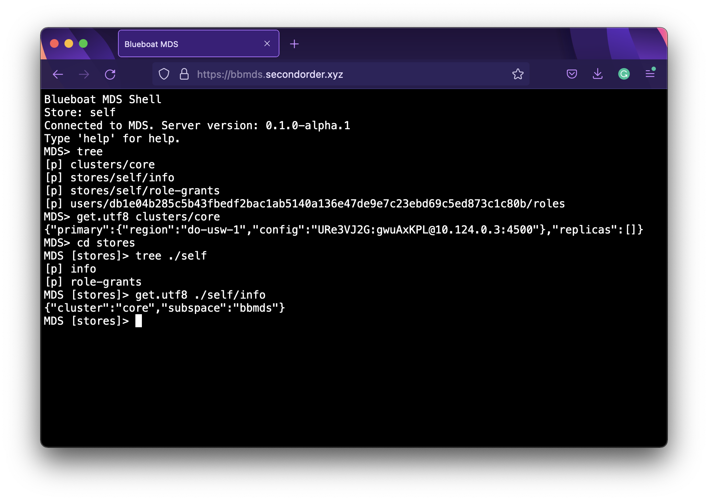

# blueboat-mds

Blueboat Metadata Service (MDS) is a distributed metadata manager for multi-region deployment of [Blueboat](https://github.com/losfair/blueboat). The MDS stores both Blueboat's own metadata as well as applications' data as key-value pairs in [FoundationDB](https://www.foundationdb.org/).

MDS supports multiple clusters and multi-region primary/replica FoundationDB deployments. Full ACID transactions are also supported via transaction scripts written in a restricted subset of JavaScript.

## CLI

If you run your own Blueboat infrastructure, you can use the MDS CLI to interact with the service:

## Deployment

Detailed instructions are WIP.

