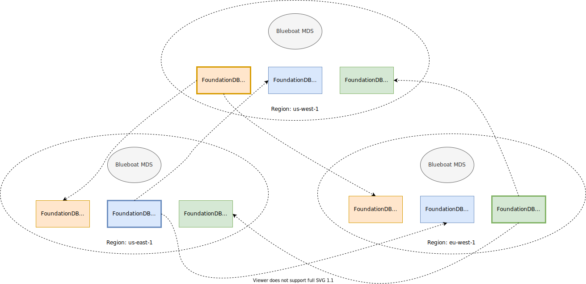
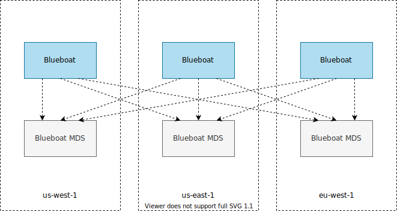

# blueboat-mds

Blueboat Metadata Service is a distributed metadata manager for [Blueboat](https://github.com/losfair/blueboat).

## Prerequisites

- At least one FoundationDB 6.3 cluster in each region.

## Deployment

